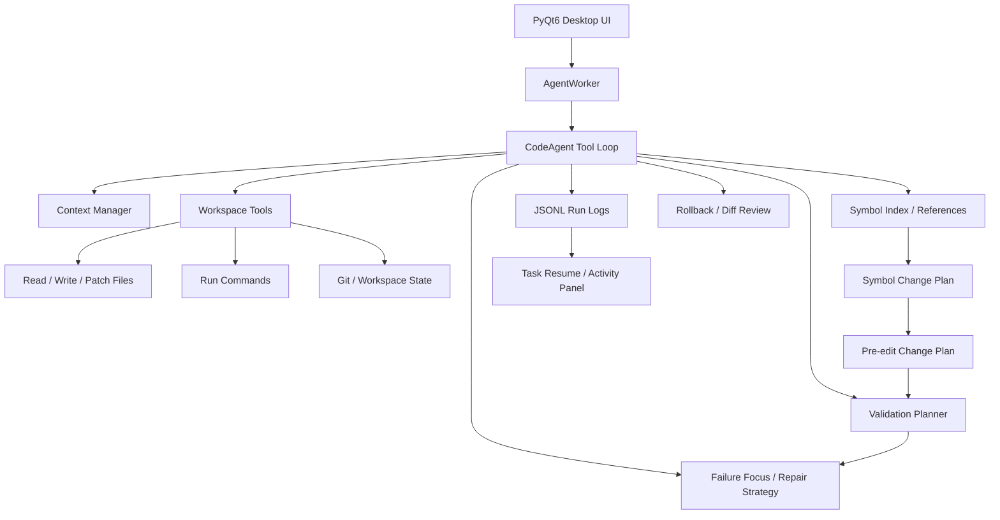

# KAgent Resume Project Showcase

## Project Positioning

KAgent is a local desktop Coding Agent and test-development automation assistant. It is built for code understanding, workspace editing, command execution, automatic validation, failure repair, run-log replay, and agent behavior auditing.

For resume usage, position it as:

> A local AI coding assistant for test-development workflows, focused on safe code modification, symbol-level impact analysis, automatic validation, failure repair, and reproducible execution logs.

## Resume Title

```text
KAgent Local Coding Agent and Test Automation Assistant
AI Engineering Tool / Test Development Tooling
```

Chinese resume version:

```text
KAgent 本地代码 Agent 与测试开发自动化助手
AI 工程工具 / 测试开发工具方向
```

## Technology Stack

- Python, PyQt6, SQLite
- OpenAI-compatible Chat Completions API
- Python AST, lightweight multi-language symbol scanning
- JSON Schema style tool definitions
- JSONL run logs
- Pytest, py_compile, project validation scripts
- Git, rollback records, diff review

## Architecture



## Core Workflow

When the user asks KAgent to change code, the Agent can run this loop:

1. Understand the task and inspect project context.
2. Locate files, functions, classes, imports, and references.
3. Build a symbol-level change plan before editing.
4. Generate an edit change plan with risk and validation hints.
5. Apply a patch or write files.
6. Run syntax checks, symbol-related tests, file-related tests, and full validation.
7. If validation fails, focus on failure locations and impacted symbols.
8. Summarize changed files, impacted symbols, validation results, and residual risk.
9. Write a JSONL run log for replay, debugging, and task resume.

## Highlights For Resume

- Implemented a local desktop Coding Agent with PyQt6, supporting multi-turn chat, streaming output, workspace selection, file editing, command execution, and run-log replay.
- Built a tool-call execution loop with read, search, patch, write, command, rollback, validation, symbol search, and self-improvement tools.
- Implemented context compression, tool-output compaction, long-term project memory, and task-resume prompts to keep long coding tasks stable.
- Built project-map and multi-language symbol indexing, supporting Python AST and lightweight JS/TS, Go, Rust, Java symbol discovery.
- Added symbol-level code intelligence: focused symbol context, symbol references, symbol change plans, impacted tests, validation commands, and risk summaries.
- Connected symbol impact to edit plans, validation plans, final summaries, run logs, and validation-failure repair prompts.
- Implemented safety mechanisms including command-risk classification, pre-edit change plans, patch-failure recovery, tool-call loop detection, selective rollback, and final trust checks.
- Built validation automation that prioritizes syntax checks, symbol-impact tests, related tests, learned validation commands, and full project validation.

## Test Development Angle

This project is especially suitable for a game test-development resume because it demonstrates:

- Automation tooling ability beyond manual testing.
- CLI/tool integration and workflow orchestration.
- Test selection and validation planning.
- Failure diagnosis and repair-loop design.
- Performance/test report style run logs and reproducibility.
- AI-assisted engineering workflow design.

It can replace the RenderDoc Agent project if the resume needs stronger AI/tooling depth. Keep RenderDoc, Perfeye, PIX, memory snapshot, and frame capture keywords in internship experience and skills, while using KAgent as the main AI engineering project.

## Suggested Resume Bullet Version

```text
KAgent 本地代码 Agent 与测试开发自动化助手
AI 工程工具 / 测试开发工具方向

- 基于 Python + PyQt6 + OpenAI API 实现本地 Coding Agent，支持项目读取、代码修改、命令执行、自动验证、运行日志复盘和任务恢复。
- 设计工具调用循环，封装 read_file、apply_patch、run_command、rollback、validation_plan、symbol_change_plan 等工具，实现“理解需求 -> 修改代码 -> 验证 -> 总结”的闭环。
- 构建上下文压缩、工具输出压缩、长期项目记忆和任务恢复机制，降低长任务上下文膨胀、重复扫描和中断后无法继续的问题。
- 实现项目文件地图、多语言符号索引、符号引用分析和符号级变更计划，可在修改函数/类前分析定义位置、引用范围、相关测试和风险。
- 实现符号影响驱动验证与失败修复，自动选择相关测试，验证失败后聚焦读取失败测试和被影响符号定义，提高问题定位效率。
- 实现编辑前变更计划、风险策略、Patch 失败恢复、选择性回滚、JSONL 运行日志和最终可信度检查，提高 AI 自动修改代码的安全性和可复盘性。
技术栈：Python、PyQt6、OpenAI API、AST、SQLite、Pytest、JSONL、Git
```

## Short Resume Version

```text
- 基于 Python + PyQt6 + OpenAI API 实现本地 Coding Agent，支持代码读取、修改、命令执行、自动验证和运行日志复盘。
- 构建符号级代码理解能力，支持函数/类定位、引用分析、变更影响分析、相关测试推断和符号级修复提示。
- 实现上下文压缩、长期项目记忆、任务恢复、Patch 失败恢复、选择性回滚和最终可信度检查，提升 AI 自动改代码的稳定性与安全性。
```

## Interview Explanation

If asked "what is difficult about this project?", explain:

- The challenge is not just calling an LLM. The hard part is making the Agent act safely in a real workspace.
- It needs structured tools, compressed context, risk control, validation ordering, failure diagnosis, rollback, and audit logs.
- Symbol-level impact analysis lets the Agent know which function/class it changed, which tests cover it, and where to focus when validation fails.
- The project moves from "chatbot" toward "engineering workflow automation".

## Current Verification Snapshot

Latest full validation recorded in the development log:

```text
185 tests passed
```

